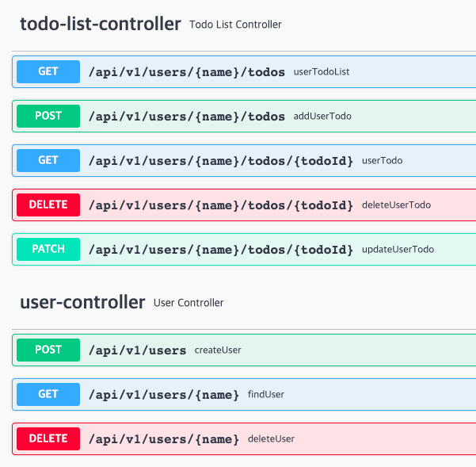

# REAL TODO-LIST

> ## FOCUSED ON
>- REST 컨벤션 준수
>- 한 메서드당 하나의 기능
>  - 가독성 확보
>- Custom Exception
>  - 에러 메시지 구체화
>- ResponseEntity 를 활용한 status & body
>- JPA 를 활용한 엔티티 CRUD
>  - Transactional
>  - ManyToOne, OneToMany
>    - FK 없는 관계
>-  일급 컬렉션(Todos)을 활용한 User별 Todo List 관리

# API
Swagger 문서화

## dto
- Request
  - RequestUserDto
  - RequestTodoDto
- Response
  - ResponseUserDto
  - ResponseTodoDto

## controller
- UserController
  - 생성 (method : POST, "/users")
    - RequestBody : RequestUserDto
  - 조회 (method : GET, "/users/{name}")
  - 삭제 (method : DELETE, "/users/{name}")
- TodoController
  - 생성  (method : POST, "/users/{name}/todo-list")
    - RequestBody : RequestTodoDto
  - 목록 조회 (method : GET, "/users/{name}/todo-list")
  - 단일 조회 (method : GET, "/users/{name}/todo-list/{todoId}")
  - 수정 (method : PATCH, "/users/{name}/todo-list/{todoId}")
    - RequestBody : RequestTodoDto
  - 삭제 (method : DELETE, "/users/{name}/todo-list/{todoId}")

## service
각 서비스에서 Entity -> Dto 변환 메서드를 따로 만들어 하나의 메서드가 하나의 역할을 가질 수 있도록 함
- CommonService
  - findUserByIdIfExists (사용자 존재하는 시 사용자 반환)
- UserService
  - findUser (사용자 검색)
  - createUser (사용자 추가)
  - deleteUser (사용자 삭제)
- TodoService
  - findTodo (할 일 검색)
  - addTodo (할 일 추가)
  - updateTodoTitle (할 일 수정) -- need help
  - deleteTodo (할 일 삭제)
  - isUserContainsTodo (해당 사용자 todo 목록에 있는지)

## exception
- ErrorCode (Enum type)을 통해 exception 관리
  - DUPLICATED_USER (중복된 사용자 예외)
  - NO_TODO (할 일 없는 예외)
  - NO_USER (사용자 없는 예외)
- 상황 별 에러메시지 구체화
  - ex) 사용자 중복시 (DUPLICATED_USER) 어떤 유저와 중복되는지 errorDetail 작성
- @RestControllerAdvice 를 활용한 에러 Response